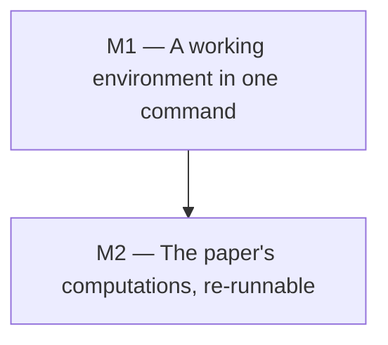

<!--
File: docs/GITHUB_PROJECT.md

The project plan for this repository.  Structure lives here; state (issue
numbers, open/closed, assignees) lives on GitHub.

This file is partially generated by the github-project engine.  Manual prose
(summary, labels, milestone descriptions, exit criteria, the dependency graph)
is hand-edited.  Issue listings between

    BEGIN GENERATED: milestone-N
    ...
    END GENERATED: milestone-N

markers are regenerated from GitHub state by `make update`; edits to those
regions will be overwritten on the next update.

Until the first `make populate`, the issue listings below are hand-authored
input rather than a mirror of GitHub.  Do not run `make update` before the
first populate: update rebuilds the regions FROM GitHub, which at that point
would erase every issue body written here.
-->

# fin-lat-rep: GitHub Project Roadmap

**Project Title**:  Bring the repository up to date, so the paper's computations can be re-run

**Repository**:  `UniversalAlgebra/fin-lat-rep`

---

## Summary

The article's results rest on three pieces of software: GAP, the Universal
Algebra Calculator, and LaTeX.  None of them is pinned anywhere in this
repository, and the versions have moved underneath the paper.  The article
cites GAP 4.8.3 (2016); on a current GAP, two of the scripts that were moved
to [fin-lat-rep-gap][] had stopped establishing what they claim, silently,
because they selected subgroups by position in a list whose order changed.  The
algebra files were similarly stale where they were published, so B28 was wrong
for a decade.

Two milestones fix the cause rather than the instances.  **Milestone 1** adds a
`flake.nix` whose default devShell carries GAP, a JVM with the Universal
Algebra Calculator, TeX Live, and Python, so that `nix develop` is the whole
setup story and everyone is running the same versions.  **Milestone 2** brings
the checks that caught the B28 error into the repository, behind a `make
verify`, so that a version bump that breaks a result is reported rather than
discovered years later.

The plan is deliberately small: two milestones, seven issues, no new
dependencies beyond Nix.  It does not try to make the whole catalog
re-derivable from scratch.  Some of the paper's searches (the closure algorithm
over `Eq(X_k)`, exhaustive sweeps of the Small Groups Library) take far longer
than any gate should, and pretending otherwise would produce an exit criterion
nobody could meet.  What is in scope is that every tool the paper used is one
command away, and that the claims which *can* be checked quickly are checked on
every change.

---

## Labels

The `milestone-N-*` labels are load-bearing: populate attaches them, and update
uses them to decide which generated region an issue belongs to (they survive
milestone renames, unlike the milestone title).  The others are ordinary topic
labels.  `enhancement` already exists on this repository and is reused with its
existing color; `documentation` is new.

- `milestone-1-environment` (0075ca): Milestone 1: a working environment in one command.
- `milestone-2-verification` (5319e7): Milestone 2: the paper's computations, re-runnable.
- `enhancement` (84b6eb): New capability or improvement.
- `documentation` (0e8a16): Documentation changes.

---

## Milestones

### Milestone 1 — A working environment in one command

**Description:**

Add a `flake.nix` whose default devShell provides every program the article
depends on, and say so in the documentation.  A visitor who clones the
repository and runs `nix develop` should be able to build the paper, run the
GAP programs, and open the `.ua` files in the Universal Algebra Calculator,
without installing anything else and without matching versions by hand.

This milestone also gives the repository its first top-level `Makefile`, which
Milestone 2 then hangs its verification targets on, and splits the decade-old
git and Emacs tutorial out of `README.md` into `CONTRIBUTING.md`.

**Exit criterion:**

On a machine with Nix and nothing else, `nix develop` gives a shell in which
`gap --version` and `make -C article` succeed, the UACalc command line reads a
`.ua` file, and the bounded GUI smoke test from M1-2 passes.  That last one
needs a definition, because a GUI does not exit: run it under a timeout and
require that it is still alive when the timeout fires, which `timeout` reports
as status 124.

    timeout 30 xvfb-run -a uacalc; test $? -eq 124

`README.md` says all of this in under a screen of text.

---

### Milestone 2 — The paper's computations, re-runnable

**Description:**

Bring the checks that found the B28 error into the repository as maintained
code rather than throwaway scripts, put them behind `make verify`, and run that
in CI.  Record the toolchain decisions that Milestone 1 makes, above all the
choice to run on a current GAP rather than the 4.8.3 the article cites, since
that choice is what silently broke two scripts and a reader deserves to know it
was made deliberately.

**Exit criterion:**

`make verify` recomputes the congruence lattice of every algebra in
`SmallLatticeReps.ua`, compares each with the lattice drawn beside it in
`article/SmallLatticeReps.tex`, and exits non-zero on any disagreement, and CI
runs it.  The toolchain decisions are written down somewhere a contributor will
find them: `docs/adr/0001-*.md` if M2-3 is done as proposed, or
`docs/TOOLCHAIN.md` if M2-3 is reduced to its lighter alternative.  The
criterion is that the decisions are recorded, not that they take a particular
form, so dropping M2-3's ADR framing does not make this milestone
unachievable.

---

### Milestone dependencies

---

## Issues

Each issue below carries its milestone, labels, and a body ready for GitHub.
On first populate, the `[MN-k]` ID in each heading becomes a `[MN-k]` title
prefix on GitHub, which is the join key that keeps re-runs idempotent, and the
new issue number is written back into the heading as a `(#N)` suffix.

## Milestone 1 — A working environment in one command

<!-- BEGIN GENERATED: milestone-1 -->

### Issue M1-1: Add a flake.nix whose default devShell carries the paper's toolchain (#25, closed)

**Labels:** `enhancement`, `milestone-1-environment`

Nothing in this repository says which version of anything the article was produced with, and the setup instructions in `README.md` assume the reader already has a working LaTeX.  A `flake.nix` with a default devShell makes the whole toolchain one command, and `flake.lock` pins it so that two people get the same GAP.

Contents of the shell:

- `gap`, with the Small Groups Library, which is included in the nixpkgs build.
- A JDK and the Universal Algebra Calculator (issue M1-2 packages it).
- TeX Live, sufficient for `article/Makefile`.  `.github/workflows/build-paper.yml` already enumerates what the article needs (`texlive-latex-extra`, `texlive-science`, `texlive-pictures`, `texlive-bibtex-extra`, `texlive-plain-generic` and the font bundles); the flake should carry the nixpkgs equivalent rather than `scheme-full`, which is several gigabytes.
- `python3` and `gnumake`, for the project targets in M1-3 and the checks in M2-1.
- `gh`.  The github-project engine shells out to it, and in `GHPROJECT_DIR` mode (M1-3) the scripts are run directly rather than through the engine's own wrapper, so `gh` has to be on the shell's PATH or `make project-populate` cannot work from a fresh `nix develop`.
- `xvfb-run`, for the headless GUI smoke test in M1-2.  Putting it in the shell rather than relying on the CI runner keeps that test runnable locally and keeps the clean-machine claim honest.
- `jython`, which is how UACalc is driven without a display.  See M1-2.

Acceptance criteria:

- `nix develop` gives a shell in which `gap --version`, `java -version`, `pdflatex --version` and `python3 --version` all succeed.
- `make -C article` builds `SmallLatticeReps.pdf` inside that shell.
- `flake.lock` is committed.
- The shell's `shellHook` prints a one-line reminder of what is available, or nothing at all; it must not print a banner on every invocation.

Measured while scoping this: GAP 4.15.1 from nixpkgs runs all five programs in [fin-lat-rep-gap][] and reproduces the numbers the article quotes.

---

### Issue M1-2: Package the Universal Algebra Calculator in the flake (#26)

**Labels:** `enhancement`, `milestone-1-environment`

The article's algebras are distributed as `.ua` files, which are only useful if the reader can open them.  UACalc is not in nixpkgs, so the flake should package it.  The following was established by hand while scoping this issue, so the work is merely assembly, not an investigation.

What is needed at runtime:

- `uacalc.jar`, served from `https://uacalc.org/uacalc.jar`.  Size 998189 bytes, sha256 `cf2e32fb11909cb04a4a3590ac1b448f891b327ae4a800a1eaaf7968328c4eee` as of 2026-09-13.  Its class files are Java 8 bytecode (major version 52) and it was built with Ant 1.9.3 under JDK 1.8.0_92.
- Four supporting jars, all four vendored in `UACalc/uacalcsrc/jars/`.  Pin that repository by commit; `538ec6a0adaaee2c81ff1a481238d944d63ce4c7` is its current head.  Of the four, only `LatDraw.jar` is also served from uacalc.org, in a newer build (151620 bytes against 134483); the other three 404 there.  Take all four from `uacalcsrc`, because that is the set the verification below was actually run against.  The jar's `Class-Path` manifest entry also names `designgridlayout-1.1p1.jar` and `swing-layout-1.0.2.jar`, which exist nowhere in either repository.  They are **not** needed: `designgridlayout` is imported only by `org/uacalc/nbui/UACalculatorUI.java`, which is not on the path taken by the `org.uacalc.nbui.UACalculator2` entry point.
- A JDK.  **OpenJDK 21 works**; there is no need to pin Java 8.  Verified three ways.  The headless API read all 29 algebras out of
  `SmallLatticeReps.ua` and computed `|Con(B28)| = 7`, agreeing with an
  independent implementation.  The GUI entry point under `-Djava.awt.headless=true` gets as far as `HeadlessException` rather than `NoClassDefFoundError`, which is what shows the classpath is complete.  And under a virtual framebuffer the window comes up and stays up, silently:

      timeout 30 xvfb-run -a java -cp "$CP" org.uacalc.nbui.UACalculator2
      # exit status 124, no output

Do **not** try to build from `UACalc/uacalcsrc`.  Its Ant build declares six dependency jars and vendors four, targets Java 8, and carries Groovy 1.0 from
2007.  The prebuilt jar is a fraction of the work and is what uacalc.org serves to everyone else.

Acceptance criteria:

- The flake provides a `uacalc` executable on the devShell's `PATH` that launches the GUI.
- **Every** runtime artifact is pinned, not just `uacalc.jar`: a sha256 on each fetch from uacalc.org, and a commit on `uacalcsrc`.  A change to any jar on the classpath changes the environment, so pinning only the main one would leave the rest free to drift.  Measured 2026-09-14:

      cf2e32fb11909cb04a4a3590ac1b448f891b327ae4a800a1eaaf7968328c4eee  uacalc.jar              998189 B  (uacalc.org)
      43ceb01bb9c40c4e6dbd337e5851f10ebbead1a2ade6e598946cf6309a17aa1c  LatDraw.jar             134483 B  (uacalcsrc)
      d9cab69d9c26f4bfc0cc2184ddc4814a60c6542e7cfd44dc2d42730f39fdde4a  miglayout-3.7-swing.jar  75838 B  (uacalcsrc)
      bedb09ac0050dda392049c66e4ad92918050de22c44317e3c43bf3ef4d17c907  groovy-all-1.0.jar      2291484 B  (uacalcsrc)
      4c412918ca398d1da02ef8b09dab050a58ab2b3721ec23f08beb91b6fc4077a3  groovy-engine.jar         11774 B  (uacalcsrc)

  `uacalc.jar` has no version in its URL, so the hash is the mitigation rather than a fix: when it changes, the build fails loudly and someone decides.
- **The Jython command line is packaged**, which is how UACalc is driven without a display.  It is not something to invent: DeMeo and Freese wrote it, it lives in [UACalc/UACalc_CLI][], and it is documented at [uacalc-at-the-command-line][].  `uacalc.jar`'s only `Main-Class` is the Swing application `UACalculator2`, which is why the GUI is all one sees from the jar alone, but the Java API underneath is what the Jython layer exposes.

  Use `jython` from nixpkgs, currently 2.7.4, rather than the `jython-standalone-2.7-b1.jar` vendored in UACalc_CLI: that jar is a 2014 beta, and the repository carries no license and has not been touched since
  2014.  Verified 2026-09-14 on nixpkgs jython 2.7.4 with OpenJDK 21, run non-interactively with the five jars on `CLASSPATH`:

      from org.uacalc.io import AlgebraIO
      algs = AlgebraIO.readAlgebraListFile(path)
      for a in algs: print a.getName(), a.cardinality(), a.con().cardinality()

  That read all 29 algebras out of `SmallLatticeReps.ua` and computed every
  congruence lattice, giving `|Con(B28)| = 7`, agreeing with an independent
  implementation.  Expose it from the flake as a `uacalc-cli` command, with the classpath already set, so M2-1 has something to call.

  Two things need fixing as it is packaged.  `CLI/uacalc.py` hard-codes `UACALC_CLI_ROOT` to `~/git/UACalc_CLI`, and it imports `readline` and `rlcompleter` at module scope, which are interactive conveniences a scripted run should not require.  Either parameterize that bootstrap or skip it and set `CLASSPATH` directly, which is what the verification above did.
- A smoke test launches the GUI under `xvfb-run` and asserts it survives, which is cheap enough for CI and is what catches a JDK bump that breaks Swing.  `xvfb-run` is in the devShell (M1-1), so the test runs locally too.
- The [Scala REPL][scala-repl] is worth a line in the documentation as the exploratory path, `scala -classpath uacalc.jar`.  It is not a substitute for the Jython command line here: it is documented for interactive use only, with no scripted invocation and no example of loading a `.ua` file, and the version it was written against, Scala 2.10.3, is from 2013.
- The known fragility (an unversioned URL on a personal web server) is written down, either in the ADR from M2-3 or beside the package in the flake.

---

### Issue M1-3: Add a top-level Makefile and wire the github-project engine (#27)

**Labels:** `enhancement`, `milestone-1-environment`

The only `Makefile` in the repository builds the article.  A top-level one gives the project a front door, and Milestone 2 needs somewhere to put `verify`.

It should carry, at least:

- `help`, listing the targets.
- `paper`, delegating to `article/Makefile`.
- `project-lint`, `project-populate-dry`, `project-populate`, `project-update` and `project-update-check`, driving [github-project][] against `docs/GITHUB_PROJECT.md`.

The engine must be **referenced, never vendored**; a copy in this repository is exactly the drift this plan exists to stop.  Add it as a flake input, re-export its apps under a prefix, and call those from make, keeping a `GHPROJECT_DIR` escape hatch for a local checkout:

    GHPROJECT_DIR ?=
    ifneq (,$(GHPROJECT_DIR))
    GHPROJECT_LINT := python3 "$(GHPROJECT_DIR)/scripts/gh_project_lint.py"
    else
    GHPROJECT_LINT := nix run .\#ghproject-lint --
    endif

Note the escaped `\#`: an unescaped `#` starts a comment even inside a make assignment.

Acceptance criteria:

- `make help` lists the targets.
- `make project-lint` passes on `docs/GITHUB_PROJECT.md`.
- `make project-update-check` exits 0 once the plan and GitHub agree.
- `flake.lock` pins the engine, so upgrades happen on purpose via `nix flake update github-project`.

---

### Issue M1-4: Split README.md, and document the development shell (#28)

**Labels:** `milestone-1-environment`, `documentation`

About seventy of `README.md`'s hundred lines are a git-at-the-command-line tutorial and Emacs/magit setup instructions written around 2015, including advice to install magit from marmalade, which shut down.  That crowds out what a visitor actually needs, which is what this repository is and how to build it.

- `README.md` keeps: what the project is, who the authors are, where the article is, where the code and algebra files live now (see [#23][]), and the three commands that build and check it.  One screen.
- `CONTRIBUTING.md` takes: the git workflow, the Emacs/magit material if it is still wanted, how to add a BibTeX entry to the `filecontents` block rather than to the generated `inputs/refs.bib`, and troubleshooting for the devShell and the LaTeX build.
- `docs/` takes anything longer than that, including the one-algebra checking recipe from M2-1.

This is also the place to fix a small typesetting bug noticed in [#23][]: the `\gaps` macro expands to an acronym plural, so several sentences that want "GAP's Small Groups Library" typeset as "GAPs Small Groups Library".

Acceptance criteria:

- `README.md` fits on one screen and contains no instructions that are no longer true.
- `CONTRIBUTING.md` exists and is linked from `README.md`.
- Neither file tells the reader to install anything that `nix develop` provides.
- The `\gaps` rendering is fixed: no sentence in `article/SmallLatticeReps.tex` typesets "GAPs" where it means "GAP's".  Either give the macro a possessive form or reword the sentences that use it.  Without this the bug survives all the other criteria.

<!-- END GENERATED: milestone-1 -->

## Milestone 2 — The paper's computations, re-runnable

<!-- BEGIN GENERATED: milestone-2 -->

### Issue M2-1: Bring the congruence-lattice check into the repository (#29, closed)

**Labels:** `enhancement`, `milestone-2-verification`

## Description

The check that found #20 exists only as a script written during that investigation and thrown away.  It should be maintained code.

### What it does

Read `CongruenceLatReps/SmallLatticeReps.ua` from [AlgebraFiles][], compute the congruence lattice of each algebra `B`*i* by closing each pair under the unary operations and join-closing the principal congruences, parse the covering relations of the lattice `L`*i* drawn beside it in the catalog subsection of `article/SmallLatticeReps.tex`, and test the two for isomorphism.

When this was written the catalog's diagrams were inline, as `\node(k) at ...` and `\draw(a)--(b);`, and nothing else (235 `\node` lines and 278 edges, no `\input`, no chained `\draw ... to ...` paths), and parsing those two forms was enough to check all 29 algebras.  Since #6 every diagram is a TikZ pic in `article/inputs/tikz/L<i>.tex`, in one prescribed shape under a header that declares the covering relation, and the checker reads the file the catalog's `\hasse{L<i>}` call names and compares the algebra, the drawing and the header pairwise.  Either way, **the checker must assert that every algebra's lattice is drawn** and fail otherwise, so that a diagram that goes missing stops the check loudly rather than being skipped.  Not an equality of counts: the catalog draws 35 lattices and only 29 have an algebra, by design.  Run over the current file it reports agreement for all 29 algebras; run over the copy that was published before #22 it reports an 8-element lattice for B28, which is the bug.

### Decisions needed

Two things worth deciding while implementing:

- **Which engine computes Con**. A short independent implementation is a genuine second opinion and has no dependencies; driving UACalc through the Jython command line from M1-2 checks the file against the program the article actually used.  Doing both, and comparing, is strictly better than either, and both were run by hand during scoping: they agree on all 29 algebras.

Note the language split this creates.  Jython is Python 2, so the UACalc side cannot share code with a Python 3 checker under `scripts/python/`.  Keep the Jython script small and let it emit a simple table that the Python 3 side reads and compares, rather than trying to make one program serve both.

- **Where the `.ua` file comes from**. It now lives in [AlgebraFiles][], not here.  Either fetch it at check time, which tests the published artifact and needs the network, or pin it as a flake input, which is reproducible and can go stale.  Prefer the flake input, so the check has something to be stale *against*.

This repository has no Python in it yet, so the checker establishes the convention rather than following one already here.  Use the one these projects use elsewhere: everything under `scripts/python/`, total functions that return a result rather than raising for control flow, type annotations throughout, a file-header comment saying what the file is for, and a Makefile target per test suite.  The annotations are gated rather than left to review: `mypy --strict` is in the dev shell, `make typecheck` runs it, and `make verify` runs that first, since it reads the annotations and executes nothing.

### Acceptance criteria

- [ ] The check runs from a Makefile target and exits non-zero on disagreement.
- [ ] It has a test that fails against the pre-[#22][] algebra file, so the check is shown to have teeth rather than merely to pass.  That input needs to be pinned, since the published copy is now corrected and the old one exists only in history.  Check in a small fixture holding just the defective B28, under `scripts/python/fixtures/`, with its sha256 recorded; the source is `CongruenceLatReps/SmallLatticeReps.ua` at AlgebraFiles commit `9e1ef390ef7a1288cdabdfb449d23c9095c02173`.  A fixture is preferable to fetching that revision at test time, because the test then needs no network and cannot be broken by anything upstream.
- [ ] Its output names the algebra and prints both covering relations when they disagree.
- [ ] **`docs/CHECKING-AN-ALGEBRA.md` shows how to check a single algebra by hand**, in both engines, with a worked example and its real output.  This is the recipe a collaborator reaches for when they want to satisfy themselves about one entry rather than run the whole gate, and without it the knowledge lives only in whoever wrote the checker.  It should be short enough to follow in a couple of minutes, and it should say what the answer means: that the catalog holds lattices of size *at most* seven, 2 of size 5, 6 of size 6 and 27 of size 7, so a five-element congruence lattice is the right answer for B1, whose L1 is the pentagon, and not a sign of trouble.  Worked example:

      $ CLASSPATH=... jython check.py CongruenceLatReps/SmallLatticeReps.ua
      B1        |A| =  4   |Con(A)| = 5
      B28       |A| = 16   |Con(A)| = 7

[AlgebraFiles]: https://github.com/UACalc/AlgebraFiles
[#22]: https://github.com/UniversalAlgebra/fin-lat-rep/pull/22

---

### Issue M2-2: Add `make verify`, and run it in CI (#30)

**Labels:** `enhancement`, `milestone-2-verification`

Tie the checks together and put a gate on them.

`make verify` should run, at least:

- the congruence-lattice check from M2-1;
- a structural pass over the `.ua` files: every operation table has `cardinality ** arity` entries, all in range;
- the GAP programs from [fin-lat-rep-gap][] that are fast enough to gate.  Those live in another repository as of [#23][], so `make verify` has to obtain them at a recorded revision: add that repository as a flake input, so `flake.lock` pins it and `nix flake update` moves it deliberately.  A floating clone would make this gate depend on unreviewed upstream changes, which is the opposite of what it is for.  `PJ17.gap` takes seconds and `PJ11.gap` under a minute; `Hexagon.g` needs a few minutes and several gigabytes of memory for the subgroup lattice of A11; `pentagonSearch.g` takes about five minutes.  Gate the first two and leave the rest to a scheduled run.

On CI cost: the existing `build-paper.yml` installs TeX Live from apt in a few minutes.  A Nix job that has to realize GAP and a JDK will be slower on a cold cache, so use a Nix store cache action, and consider running the expensive half on a schedule rather than on every push.  Note also that a GAP upgrade is exactly the event this gate exists to catch, so it should run on `flake.lock` changes even when nothing else changed.

Acceptance criteria:

- `make verify` passes in the devShell and is documented in `README.md`.  Note that this is the gate, not the recipe: how to check one algebra by hand is M2-1's `docs/CHECKING-AN-ALGEBRA.md`, and `README.md` should link it.
- A workflow runs it on pull requests touching `scripts/`, `uacalc-files/`, `article/SmallLatticeReps.tex`, `article/inputs/tikz/**`, `flake.nix`, `flake.lock`, `Makefile`, or the workflow file itself.  The tikz path is where every diagram the checker reads has lived since #6, one pic file per lattice, so a change there is a change to what the check compares against.  The last four matter as much as the first three: a change to `flake.nix` can alter the environment without touching the lock, a change to `Makefile` can alter or remove `verify`, and a change to the workflow can disable the gate.  Any of those slipping through unverified would make the guarantee hollow.
- The slow checks run on a schedule and open or update a single tracking issue on failure rather than emailing on every run.

---

### Issue M2-3: Record the toolchain decisions in an ADR (#31)

**Labels:** `milestone-2-verification`, `documentation`

Three decisions in this plan will be asked about later, and the evidence for them is fresh now and will not be in a year.

1. **Run on a current GAP, not the 4.8.3 the article cites.**  This is not cosmetic.  Between those versions the ordering of `ConjugacyClassesSubgroups` and `MaximalSubgroupClassReps` changed, and two scripts that selected subgroups by position silently stopped establishing their claims: `Hexagon.g` reported five maximal subgroups of A11 containing `H` where the article says two, with no error.  Hulpke's fast `IntermediateSubgroups` method, which this repository vendored as a patch because GAP 4.8 lacked it and which now sits in [fin-lat-rep-gap][]'s `obsolete/` directory after [#23][], has been in the GAP library since 4.9.  The decision is to track a current GAP and select by property rather than by index, and the rule belongs somewhere a future contributor will read it.
2. **Fetch the UACalc jar rather than build from source**, with the consequences from M1-2: an unversioned URL on a personal web server, pinned by hash.
3. **What "reproducible" means here**, and what is deliberately out of scope: the closure-algorithm searches and the exhaustive Small Groups sweeps are re-runnable but not gateable.

This repository has no ADRs, so the format is proposed here rather than inherited.  Follow the one used in these projects elsewhere, for which [agda-native-air's `docs/adr/0002-agda-mcp.md`][adr-exemplar] is the worked example: a plain title, a `File:` line, bullets for Status, Date, Tracking and Ancestry, an executive summary, one section per decision area with its own Decision, Evidence and Status, a numbered decision log, and reference-style links.  Explanation of the environment itself belongs in a companion note the ADR links, not in the ADR.

Acceptance criteria:

- `docs/adr/0001-reproducible-environment.md` exists and follows that shape.
- The companion note it links exists too.  The ADR records the decisions; the explanation of how the environment actually works belongs beside it, and an ADR linking nothing would satisfy the letter of this issue while losing the half a reader needs.
- Each decision cites what was measured, with the GAP version the measurement was made on.
- `CONTRIBUTING.md` links it.

**Scope note.**  This is the issue to drop if the plan feels heavy.  A single `docs/TOOLCHAIN.md` carrying the same three facts would cost a tenth as much and lose only the ancestry and the decision log.  It is proposed as an ADR because the first decision is genuinely contested and evidence-backed, not because the repository needs an ADR practice.

<!-- END GENERATED: milestone-2 -->

## Unplanned work

Issues filed organically on GitHub, with no `[MN-k]` prefix in the title, are
invisible to the milestone regions above.  This region mirrors them, grouped by
GitHub milestone and sorted by issue number, so that field-driven work still
shows up in the plan.  It is filled by the first `make update` after populate;
until then it is empty by design.

Everything currently open on this repository is mathematical work on the
article itself, which is why none of it appears in the milestones above.

<!-- BEGIN GENERATED: unplanned -->

#### Boulder Dash

### Write an outline. (#2)

**Labels:** 

_(no description on GitHub)_

---

### Add a section at the end on open problems. (#3)

**Labels:** 

_(no description on GitHub)_

---

### say what we mean by "minimal representation" (#13, closed)

**Labels:** 

- minimal representation in terms of cardinality of the algebra.
- smallest ~~group~~ index in a group representation
  (I think we once had an example of a lattice that can be represented using a group with a certain index, but if we use a bigger G, we can get a smaller [G:H], which leads to a smaller algebra. I'll try to track that down.)

#### June 13 deadline

### Concrete representation terminology (#8, closed)

**Labels:** `enhancement`

This is somewhat confusing. What I think is best for the two notions is

  representations of finite lattices as congruence lattices of a finite
  algebra

  representations of finite lattices as lattices of equivalence relations
  on a finite set

The first is most important for us and we abbreviate it to just
representation of L.  But I think we should use the second (or a
shortening of it) in place of "concrete representation."

The concrete representation problem (is a sublattice of Eq X a congruence
lattice where it sits) still makes sense.

Unlike changing the diagram, which naturally was assigned to William, this
should be assigned to all of us, ie., whoever gets to it first.

---

### add more justification for reproving Snow (#14, closed)

**Labels:** 

I added references to Snow's articles, but we should also say why we reproved it using these h functions. (It's because we're interested in the resulting algebra, so knowing the operations is important to us.)

---

### Compute cardinality of Palfy's and Achbacher's hexagon constructions (#17)

**Labels:** 

**Assignees:** @williamdemeo

This shouldn't be too hard.  Look at Palfy's slides (in the misc directory).

Include this cardinality on page 2, where hexagon is mentioned.

---

### Clean up GAP code repo; add references to code and .ua files (#18, closed)

**Labels:** 

**Assignees:** @williamdemeo

## Description

On page 2, "Using these methods combined with programs we have developed using GAP, UACalc, and others..." add references and links to programs.

Sec. 4.1. Algorithms: "Finally we used group theoretic methods, usually with the aid of GAP. A
detailed example of this is given after Figure 9."  Expand this; say where the gap programs are. Also mention where the `.ua` files for the B's are.

---

### Theorem 2.2: clean up last part of proof (#19)

**Labels:** 

**Assignees:** @williamdemeo

The last paragraph of the proof of the Kurzweil--Netter Theorem 2.2 is still a bit hand-wavy.  Make it more explicit.

Remark (2) that now appears after the proof elaborates on this a bit, but imo it's still not clear enough.

#### (no milestone)

### do something (#1, closed)

**Labels:** 

do it now!

---

### Combine all main input files into one (#4, closed)

**Labels:** 

**Assignees:** @williamdemeo

It will make it much easier to edit this way.  It's a pain to have to search for things that need modifying (e.g., for handling latex compilation errors) when there are many input files.  We should combine all primary input files into one master file, called SmallLatticeReps.tex (or maybe we should call it fin-lat-rep.tex?).

We will still keep minor input files, like lattice drawings, separate, since these might be used in multiple locations in the paper, and we want to try to keep the lattice drawing style consistent.

---

### Create tikz subdirectory for Hasse diagrams files (#5, closed)

**Labels:** 

**Assignees:** @williamdemeo

It seems like a good idea to keep the tikz input for each Hasse diagram in a separate file, so we can easily include them wherever we like in the main article and they will be drawn in a consistent way.  However, this will result in a ton of input files.  Is that a drawback?

Probably this subdirectory should go here: input/tikz.

---

### Organize tikz input files for Hasse diagrams (#6)

**Labels:** 

**Assignees:** @williamdemeo

Each lattice should go in a separate file and they should all have roughly uniform size/scale. (When inputting them in the main article, the size/scale can be altered with the the scale and scalefont commands.)

---

### Right diagram in Fig 1 and in Lemma 2.3. (#7, closed)

**Labels:** 

**Assignees:** @williamdemeo

It appears that alpha + beta is one and their meet is zero. Push the upper blob up so the line out of beta does not appear to go to 1 and the line from alpha does not appear to go to 0.

---

### Improve notation/presentation of section 2.1 (#9, closed)

**Labels:** 

It's ugly. I'll edit now... hopefully I can make it less ugly.

---

### fix line overruns (#10, closed)

**Labels:** 

e.g., on page 4

---

### fix broken reference on page 11 (#11, closed)

**Labels:** 

in last paragraph

---

### specify which are "group representable" (#12)

**Labels:** 

_(no description on GitHub)_

---

### Define group representable on page 2 (#15, closed)

**Labels:** 

**Assignees:** @williamdemeo

Is transitivity required?

(See todo item.)

---

### Is Group(216,153) the smallest group representing the pentagon? (#16, closed)

**Labels:** 

**Assignees:** @williamdemeo

(See todo item on page 2)

---

### B28 is incorrect (#20, closed)

**Labels:** 

**Assignees:** @ralphfreese

The algebra B28 given in Section 4.2 does not have L28 as its congruence lattice. This also means SmallLatticeReps.ua in uacalc-files should be changed.

<!-- END GENERATED: unplanned -->

---

## How to use this file

1. Read the plan, edit the prose, and run `make project-lint`.
2. `make project-populate-dry` to preview, then `make project-populate` to
   create the labels, milestones and issues on GitHub.  Re-running is safe:
   existing ones are skipped.
3. Run `make project-update` once straight afterwards and commit the result.
   The canonical rendering differs cosmetically from the authored input: it
   drops each issue's `**Milestone:**` line, re-orders labels to GitHub's
   order, and trims the trailing separators.  A `--check` before that
   normalization reports stale by design.
4. From then on, work the issues on GitHub and run `make project-update`
   whenever this file should reflect reality.  Only the marked regions are
   rewritten; prose is preserved byte-for-byte.

[fin-lat-rep-gap]: https://github.com/UniversalAlgebra/fin-lat-rep-gap
[AlgebraFiles]: https://github.com/UACalc/AlgebraFiles
[github-project]: https://github.com/williamdemeo/github-project
[adr-exemplar]: https://github.com/formalverification/agda-native-air/blob/main/docs/adr/0002-agda-mcp.md
[UACalc/UACalc_CLI]: https://github.com/UACalc/UACalc_CLI
[uacalc-at-the-command-line]: https://universalalgebra.wordpress.com/documentation/uacalc/uacalc-at-the-command-line/
[scala-repl]: https://universalalgebra.wordpress.com/documentation/scala/scala-repl-with-uacalc-objects/
[#20]: https://github.com/UniversalAlgebra/fin-lat-rep/issues/20
[#22]: https://github.com/UniversalAlgebra/fin-lat-rep/pull/22
[#23]: https://github.com/UniversalAlgebra/fin-lat-rep/pull/23
