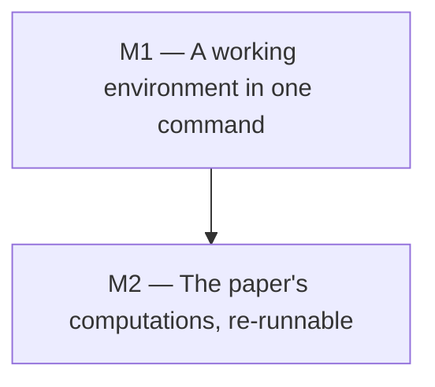

<!--
File: docs/GITHUB_PROJECT.md

The project plan for this repository.  Structure lives here; state (issue
numbers, open/closed, assignees) lives on GitHub.

This file is partially generated by the github-project engine.  Manual prose
(summary, labels, milestone descriptions, exit criteria, the dependency graph)
is hand-edited.  Issue listings between

    BEGIN GENERATED: milestone-N
    ...
    END GENERATED: milestone-N

markers are regenerated from GitHub state by `make update`; edits to those
regions will be overwritten on the next update.

Until the first `make populate`, the issue listings below are hand-authored
input rather than a mirror of GitHub.  Do not run `make update` before the
first populate: update rebuilds the regions FROM GitHub, which at that point
would erase every issue body written here.
-->

# fin-lat-rep: GitHub Project Roadmap

**Project Title**:  Bring the repository up to date, so the paper's computations can be re-run

**Repository**:  `UniversalAlgebra/fin-lat-rep`

---

## Summary

The article's results rest on three pieces of software: GAP, the Universal
Algebra Calculator, and LaTeX.  None of them is pinned anywhere in this
repository, and the versions have moved underneath the paper.  The article
cites GAP 4.8.3 (2016); on a current GAP two of the four scripts that were
moved to [fin-lat-rep-gap][] had stopped establishing what they claim, silently,
because they selected subgroups by position in a list whose order changed.  The
algebra files were similarly stale where they were published, so B28 was wrong
for a decade.

Two milestones fix the cause rather than the instances.  **Milestone 1** adds a
`flake.nix` whose default devShell carries GAP, a JVM with the Universal
Algebra Calculator, TeX Live, and Python, so that `nix develop` is the whole
setup story and everyone is running the same versions.  **Milestone 2** brings
the checks that caught the B28 error into the repository, behind a `make
verify`, so that a version bump that breaks a result is reported rather than
discovered years later.

The plan is deliberately small: two milestones, seven issues, no new
dependencies beyond Nix.  It does not try to make the whole catalog
re-derivable from scratch.  Some of the paper's searches (the closure algorithm
over `Eq(X_k)`, exhaustive sweeps of the Small Groups Library) take far longer
than any gate should, and pretending otherwise would produce an exit criterion
nobody could meet.  What is in scope is that every tool the paper used is one
command away, and that the claims which *can* be checked quickly are checked on
every change.

---

## Labels

The `milestone-N-*` labels are load-bearing: populate attaches them, and update
uses them to decide which generated region an issue belongs to (they survive
milestone renames, unlike the milestone title).  The others are ordinary topic
labels.  `enhancement` already exists on this repository and is reused with its
existing color; `documentation` is new.

- `milestone-1-environment` (0075ca): Milestone 1: a working environment in one command.
- `milestone-2-verification` (5319e7): Milestone 2: the paper's computations, re-runnable.
- `enhancement` (84b6eb): New capability or improvement.
- `documentation` (0e8a16): Documentation changes.

---

## Milestones

### Milestone 1 — A working environment in one command

**Description:**

Add a `flake.nix` whose default devShell provides every program the article
depends on, and say so in the documentation.  A visitor who clones the
repository and runs `nix develop` should be able to build the paper, run the
GAP programs, and open the `.ua` files in the Universal Algebra Calculator,
without installing anything else and without matching versions by hand.

This milestone also gives the repository its first top-level `Makefile`, which
Milestone 2 then hangs its verification targets on, and splits the decade-old
git and Emacs tutorial out of `README.md` into `CONTRIBUTING.md`.

**Exit criterion:**

On a machine with Nix and nothing else, `nix develop` followed by each of
`gap --version`, `uacalc` (with a display) and `make -C article` succeeds, and
`README.md` says so in under a screen of text.

---

### Milestone 2 — The paper's computations, re-runnable

**Description:**

Bring the checks that found the B28 error into the repository as maintained
code rather than throwaway scripts, put them behind `make verify`, and run that
in CI.  Record the toolchain decisions that Milestone 1 makes, above all the
choice to run on a current GAP rather than the 4.8.3 the article cites, since
that choice is what silently broke two scripts and a reader deserves to know it
was made deliberately.

**Exit criterion:**

`make verify` recomputes the congruence lattice of every algebra in
`SmallLatticeReps.ua`, compares each with the lattice drawn beside it in
`article/SmallLatticeReps.tex`, and exits non-zero on any disagreement; CI runs
it; and `docs/adr/0001-*.md` records why the environment is pinned the way it
is.

---

### Milestone dependencies

---

## Issues

Each issue below carries its milestone, labels, and a body ready for GitHub.
On first populate, the `[MN-k]` ID in each heading becomes a `[MN-k]` title
prefix on GitHub, which is the join key that keeps re-runs idempotent, and the
new issue number is written back into the heading as a `(#N)` suffix.

## Milestone 1 — A working environment in one command

<!-- BEGIN GENERATED: milestone-1 -->

### Issue M1-1: Add a flake.nix whose default devShell carries the paper's toolchain

**Labels:** `milestone-1-environment`, `enhancement`
**Milestone:** 1. A working environment in one command

Nothing in this repository says which version of anything the article was
produced with, and the setup instructions in `README.md` assume the reader
already has a working LaTeX.  A `flake.nix` with a default devShell makes the
whole toolchain one command, and `flake.lock` pins it so that two people get
the same GAP.

Contents of the shell:

- `gap`, with the Small Groups Library, which is included in the nixpkgs build.
- A JDK and the Universal Algebra Calculator (issue M1-2 packages it).
- TeX Live, sufficient for `article/Makefile`.  `.github/workflows/build-paper.yml`
  already enumerates what the article needs (`texlive-latex-extra`,
  `texlive-science`, `texlive-pictures`, `texlive-bibtex-extra`,
  `texlive-plain-generic` and the font bundles); the flake should carry the
  nixpkgs equivalent rather than `scheme-full`, which is several gigabytes.
- `python3` and `gnumake`, for the project targets in M1-3 and the checks in M2-1.

Acceptance criteria:

- `nix develop` gives a shell in which `gap --version`, `java -version`,
  `pdflatex --version` and `python3 --version` all succeed.
- `make -C article` builds `SmallLatticeReps.pdf` inside that shell.
- `flake.lock` is committed.
- The shell's `shellHook` prints a one-line reminder of what is available, or
  nothing at all; it must not print a banner on every invocation.

Measured while scoping this: GAP 4.15.1 from nixpkgs runs all five programs in
[fin-lat-rep-gap][] and reproduces the numbers the article quotes.

---

### Issue M1-2: Package the Universal Algebra Calculator in the flake

**Labels:** `milestone-1-environment`, `enhancement`
**Milestone:** 1. A working environment in one command

The article's algebras are distributed as `.ua` files, which are only useful if
the reader can open them.  UACalc is not in nixpkgs, so the flake has to
package it.  The following was established by hand while scoping this issue, so
the work is assembly rather than investigation.

What is needed at runtime:

- `uacalc.jar`, served from `https://uacalc.org/uacalc.jar`.  Size 998189
  bytes, sha256 `cf2e32fb11909cb04a4a3590ac1b448f891b327ae4a800a1eaaf7968328c4eee`
  as of 2026-09-13.  Its class files are Java 8 bytecode (major version 52) and
  it was built with Ant 1.9.3 under JDK 1.8.0_92.
- Four supporting jars: `LatDraw.jar`, `groovy-all-1.0.jar`,
  `groovy-engine.jar`, `miglayout-3.7-swing.jar`.  Two sources, and they
  disagree.  `UACalc/uacalcsrc/jars/` vendors all four, but its `LatDraw.jar`
  (134483 bytes) and `miglayout-3.7-swing.jar` (75838 bytes) are older than the
  copies uacalc.org serves and ships beside the release (151620 and 83768
  bytes).  Prefer uacalc.org where it serves the jar, since that is what the
  released `uacalc.jar` was built against, and fall back to `uacalcsrc/jars/`
  for `groovy-all-1.0.jar` and `groovy-engine.jar`, which uacalc.org does not
  serve.  Note that the verification below was done with the older
  `uacalcsrc` set, so re-run it against whichever set the flake ends up
  pinning.  The
  jar's `Class-Path` manifest entry also names `designgridlayout-1.1p1.jar` and
  `swing-layout-1.0.2.jar`, which exist nowhere in either repository.  They are
  **not** needed: `designgridlayout` is imported only by
  `org/uacalc/nbui/UACalculatorUI.java`, which is not on the path taken by the
  `org.uacalc.nbui.UACalculator2` entry point.
- A JDK.  **OpenJDK 21 works**; there is no need to pin Java 8.  Verified
  three ways.  The headless API read all 29 algebras out of
  `SmallLatticeReps.ua` and computed `|Con(B28)| = 7`, agreeing with an
  independent implementation.  The GUI entry point under
  `-Djava.awt.headless=true` gets as far as `HeadlessException` rather than
  `NoClassDefFoundError`, which is what shows the classpath is complete.  And
  under a virtual framebuffer the window comes up and stays up, silently:

      timeout 30 xvfb-run -a java -cp "$CP" org.uacalc.nbui.UACalculator2
      # exit status 124, no output

Do **not** try to build from `UACalc/uacalcsrc`.  Its Ant build declares six
dependency jars and vendors four, targets Java 8, and carries Groovy 1.0 from
2007.  The prebuilt jar is a fraction of the work and is what uacalc.org serves
to everyone else.

Acceptance criteria:

- The flake provides a `uacalc` executable on the devShell's `PATH` that
  launches the GUI.
- The fetch pins the sha256, so that a change to the upstream jar fails the
  build loudly instead of changing results quietly.  There is no version in the
  URL; this is the mitigation, not a fix.
- A headless entry point is also available, so M2-1 can call UACalc from a
  script without a display.
- A smoke test launches the GUI under `xvfb-run` and asserts it survives, which
  is cheap enough for CI and is what catches a JDK bump that breaks Swing.
- The known fragility (an unversioned URL on a personal web server) is written
  down, either in the ADR from M2-3 or beside the package in the flake.

---

### Issue M1-3: Add a top-level Makefile and wire the github-project engine

**Labels:** `milestone-1-environment`, `enhancement`
**Milestone:** 1. A working environment in one command

The only `Makefile` in the repository builds the article.  A top-level one
gives the project a front door, and Milestone 2 needs somewhere to put `verify`.

It should carry, at least:

- `help`, listing the targets.
- `paper`, delegating to `article/Makefile`.
- `project-lint`, `project-populate-dry`, `project-populate`, `project-update`
  and `project-update-check`, driving [github-project][] against
  `docs/GITHUB_PROJECT.md`.

The engine must be **referenced, never vendored**; a copy in this repository is
exactly the drift this plan exists to stop.  Add it as a flake input, re-export
its apps under a prefix, and call those from make, keeping a `GHPROJECT_DIR`
escape hatch for a local checkout:

    GHPROJECT_DIR ?=
    ifneq (,$(GHPROJECT_DIR))
    GHPROJECT_LINT := python3 "$(GHPROJECT_DIR)/scripts/gh_project_lint.py"
    else
    GHPROJECT_LINT := nix run .\#ghproject-lint --
    endif

Note the escaped `\#`: an unescaped `#` starts a comment even inside a make
assignment.

Acceptance criteria:

- `make help` lists the targets.
- `make project-lint` passes on `docs/GITHUB_PROJECT.md`.
- `make project-update-check` exits 0 once the plan and GitHub agree.
- `flake.lock` pins the engine, so upgrades happen on purpose via
  `nix flake update github-project`.

---

### Issue M1-4: Split README.md, and document the development shell

**Labels:** `milestone-1-environment`, `documentation`
**Milestone:** 1. A working environment in one command

About seventy of `README.md`'s hundred lines are a git-at-the-command-line
tutorial and Emacs/magit setup instructions written around 2015, including
advice to install magit from marmalade, which shut down.  That crowds out what
a visitor actually needs, which is what this repository is and how to build it.

- `README.md` keeps: what the project is, who the authors are, where the
  article is, where the code and algebra files live now (see [#23][]), and the
  three commands that build and check it.  One screen.
- `CONTRIBUTING.md` takes: the git workflow, the Emacs/magit material if it is
  still wanted, how to add a BibTeX entry to the `filecontents` block rather
  than to the generated `inputs/refs.bib`, and troubleshooting for the devShell
  and the LaTeX build.
- `docs/` takes anything longer than that.

This is also the place to fix a small typesetting bug noticed in [#23][]: the
`\gaps` macro expands to an acronym plural, so several sentences that want
"GAP's Small Groups Library" typeset as "GAPs Small Groups Library".

Acceptance criteria:

- `README.md` fits on one screen and contains no instructions that are no
  longer true.
- `CONTRIBUTING.md` exists and is linked from `README.md`.
- Neither file tells the reader to install anything that `nix develop` provides.

---

<!-- END GENERATED: milestone-1 -->

## Milestone 2 — The paper's computations, re-runnable

<!-- BEGIN GENERATED: milestone-2 -->

### Issue M2-1: Bring the congruence-lattice check into the repository

**Labels:** `milestone-2-verification`, `enhancement`
**Milestone:** 2. The paper's computations, re-runnable

The check that found [#20][] exists only as a script written during that
investigation and thrown away.  It should be maintained code.

What it does: read `CongruenceLatReps/SmallLatticeReps.ua` from
[AlgebraFiles][], compute the congruence lattice of each algebra `B`*i* by
closing each pair under the unary operations and join-closing the principal
congruences, parse the covering relations of the lattice `L`*i* drawn beside it
in `article/SmallLatticeReps.tex` out of the TikZ (`\node(k) at ...` and
`\draw(a)--(b);` lines), and test the two for isomorphism.  Run over the
current file it reports agreement for all 29 algebras; run over the copy that
was published before [#22][] it reports an 8-element lattice for B28, which is
the bug.

Two things worth deciding while implementing:

- **Which engine computes Con.** A short independent implementation is a
  genuine second opinion and has no dependencies; calling UACalc through the
  headless entry point from M1-2 checks the file against the program the
  article actually used.  Doing both, and comparing, is strictly better than
  either, and both were run by hand during scoping: they agree.
- **Where the `.ua` file comes from.** It now lives in [AlgebraFiles][], not
  here.  Either fetch it at check time, which tests the published artifact and
  needs the network, or pin it as a flake input, which is reproducible and can
  go stale.  Prefer the flake input, so the check has something to be stale
  *against*.

Python in this repository follows the house style: everything under
`scripts/python/`, total functions, type annotations throughout, a file-header
comment, and a Makefile target per test suite.

Acceptance criteria:

- The check runs from a Makefile target and exits non-zero on disagreement.
- It has a test that fails against the pre-[#22][] algebra file, so the check is
  shown to have teeth rather than merely to pass.
- Its output names the algebra and prints both covering relations when they
  disagree.

---

### Issue M2-2: Add `make verify`, and run it in CI

**Labels:** `milestone-2-verification`, `enhancement`
**Milestone:** 2. The paper's computations, re-runnable

Tie the checks together and put a gate on them.

`make verify` should run, at least:

- the congruence-lattice check from M2-1;
- a structural pass over the `.ua` files: every operation table has
  `cardinality ** arity` entries, all in range;
- the GAP programs from [fin-lat-rep-gap][] that are fast enough to gate.
  `PJ17.gap` takes seconds and `PJ11.gap` under a minute; `Hexagon.g` needs a
  few minutes and several gigabytes of memory for the subgroup lattice of
  A11; `pentagonSearch.g` takes about five minutes.  Gate the first
  two and leave the rest to a scheduled run.

On CI cost: the existing `build-paper.yml` installs TeX Live from apt in a few
minutes.  A Nix job that has to realize GAP and a JDK will be slower on a cold
cache, so use a Nix store cache action, and consider running the expensive half
on a schedule rather than on every push.  Note also that a GAP upgrade is
exactly the event this gate exists to catch, so it should run on `flake.lock`
changes even when nothing else changed.

Acceptance criteria:

- `make verify` passes in the devShell and is documented in `README.md`.
- A workflow runs it on pull requests touching `scripts/`, `uacalc-files/`,
  `flake.lock` or `article/SmallLatticeReps.tex`.
- The slow checks run on a schedule and open or update a single tracking issue
  on failure rather than emailing on every run.

---

### Issue M2-3: Record the toolchain decisions in an ADR

**Labels:** `milestone-2-verification`, `documentation`
**Milestone:** 2. The paper's computations, re-runnable

Three decisions in this plan will be asked about later, and the evidence for
them is fresh now and will not be in a year.

1. **Run on a current GAP, not the 4.8.3 the article cites.**  This is not
   cosmetic.  Between those versions the ordering of
   `ConjugacyClassesSubgroups` and `MaximalSubgroupClassReps` changed, and two
   scripts that selected subgroups by position silently stopped establishing
   their claims: `Hexagon.g` reported five maximal subgroups of
   A11 containing `H` where the article says two, with no error.
   Hulpke's fast `IntermediateSubgroups` method, vendored here as a patch
   because GAP 4.8 lacked it, has been in the GAP library since 4.9.  The
   decision is to track a current GAP and select by property rather than by
   index, and the rule belongs somewhere a future contributor will read it.
2. **Fetch the UACalc jar rather than build from source**, with the
   consequences from M1-2: an unversioned URL on a personal web server, pinned
   by hash.
3. **What "reproducible" means here**, and what is deliberately out of scope:
   the closure-algorithm searches and the exhaustive Small Groups sweeps are
   re-runnable but not gateable.

Format follows the house ADR convention: a plain title, a `File:` line, bullets
for Status, Date, Tracking and Ancestry, an executive summary, one section per
decision area with its own Decision, Evidence and Status, a numbered decision
log, and reference-style links.  Explanation of the environment itself belongs
in a companion note the ADR links, not in the ADR.

Acceptance criteria:

- `docs/adr/0001-reproducible-environment.md` exists and follows that shape.
- Each decision cites what was measured, with the GAP version the measurement
  was made on.
- `CONTRIBUTING.md` links it.

**Scope note.**  This is the issue to drop if the plan feels heavy.  A single
`docs/TOOLCHAIN.md` carrying the same three facts would cost a tenth as much
and lose only the ancestry and the decision log.  It is proposed as an ADR
because the first decision is genuinely contested and evidence-backed, not
because the repository needs an ADR practice.

---

<!-- END GENERATED: milestone-2 -->

## Unplanned work

Issues filed organically on GitHub, with no `[MN-k]` prefix in the title, are
invisible to the milestone regions above.  This region mirrors them, grouped by
GitHub milestone and sorted by issue number, so that field-driven work still
shows up in the plan.  It is filled by the first `make update` after populate;
until then it is empty by design.

Everything currently open on this repository is mathematical work on the
article itself, which is why none of it appears in the milestones above.

<!-- BEGIN GENERATED: unplanned -->

_(not yet populated: run `make update` after the first `make populate`)_
<!-- END GENERATED: unplanned -->

---

## How to use this file

1. Read the plan, edit the prose, and run `make project-lint`.
2. `make project-populate-dry` to preview, then `make project-populate` to
   create the labels, milestones and issues on GitHub.  Re-running is safe:
   existing ones are skipped.
3. Run `make project-update` once straight afterwards and commit the result.
   The canonical rendering differs cosmetically from the authored input: it
   drops each issue's `**Milestone:**` line, re-orders labels to GitHub's
   order, and trims the trailing separators.  A `--check` before that
   normalization reports stale by design.
4. From then on, work the issues on GitHub and run `make project-update`
   whenever this file should reflect reality.  Only the marked regions are
   rewritten; prose is preserved byte-for-byte.

[fin-lat-rep-gap]: https://github.com/UniversalAlgebra/fin-lat-rep-gap
[AlgebraFiles]: https://github.com/UACalc/AlgebraFiles
[github-project]: https://github.com/williamdemeo/github-project
[#20]: https://github.com/UniversalAlgebra/fin-lat-rep/issues/20
[#22]: https://github.com/UniversalAlgebra/fin-lat-rep/pull/22
[#23]: https://github.com/UniversalAlgebra/fin-lat-rep/pull/23
